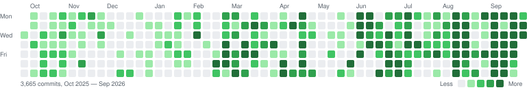

# Pavel Donin

**AI Engineer — Agent Orchestration, LLM Tooling**

_Agent systems built for daily delivery and run for real users: a ticket-driven multi-repo orchestrator, MCP servers, evals for agent skills, local inference tuned to a single GPU · 10+ years in software, 5 of them leading teams_

## Contact

[doninpr@gmail.com](mailto:doninpr@gmail.com) • [linkedin.com/in/doninpr](https://www.linkedin.com/in/doninpr) • [t.me/doninpr](https://t.me/doninpr) • [github.com/prineycom](https://github.com/prineycom) • [CV.pdf](https://github.com/prineycom/prineycom/raw/main/CV.pdf)  
Novi Sad, Serbia (CET, UTC+1) · remote · open to full-time roles worldwide

## Professional Summary

AI engineer who builds agent systems and runs them in production. At an interactive-installation studio I moved a 7-person team onto agent-driven development (agent configuration in 22 of 33 repositories within a year) and automate business processes with Hermes agents, MCP integrations and a corporate data core rolled out by an agent. For clients I deploy and operate isolated agents, including a medical-data RAG assistant with 6 active users. I co-built the ticket-driven orchestrator on Claude Code that runs my own delivery — 72 tickets merged in its first month across 4 organizations — and go deep on local inference, cutting one model's GPU memory 20× by rebuilding its TensorRT engine. 10+ years of full-stack engineering (Python, TypeScript), 5 of them leading teams.

## AI Engineering Projects

**LLM-driven development pipeline for a production studio** (Talking Birds & Flying Fish, _Aug 2025 — Present_)

- Moved a 7-person studio team onto agent-driven delivery: added the first agent configuration in Aug 2025; a year later it was in 22 of 33 web repositories, and every 2026 project started with it. Introduced the plan → isolated worktree → independent agent review → human acceptance → ship workflow, which the team adopted beyond my own repositories.
- Run studio work through the yokemate orchestrator (below): 169 agent plans across 11 studio projects; 23 studio tickets merged through the pipeline in its first month, from museum installations to internal systems.
- Built an evidence-tagged atlas of the studio's delivery over git, tracker and PR history (33 repositories, 2,299 tasks, 670 PRs) to measure what agent-driven delivery changed, with every claim tagged by its evidence: code, document or discrepancy.

**Hermes agents for business-process automation** (Talking Birds & Flying Fish, _Apr 2026 — Present_)

- Deployed Hermes Agent (Nous Research) profiles for staff: Telegram access, a Docker sandbox per profile, Microsoft 365 over MCP, and a shared skill bank rolled out by symlink — CG and 3D budget estimates from a brief to a priced spreadsheet and client PDF, estimate-template expertise, a freelancer database with privacy rules for group chats — covered by a promptfoo eval suite with LLM-as-judge.
- Built the data layer the agents work on: a corporate data core on self-hosted Supabase designed from an audit of every department's spreadsheets, its 22-migration schema rolled out by an agent through the Supabase MCP server from a self-verifying spec; an hourly Python service syncing PII-free views to SharePoint through Microsoft Graph (production since Sep 2026); the HR vacation tracker moved onto the database in two weeks (7 migrations, 10 merged PRs, tests from 21 to 135).
- Built Microsoft Teams bots on the data core — a company-wide HR bot (vacations and days off, worklogs, calendar, policy search) and bots for management to update corporate data — and a company RAG over SharePoint documents, now in integration.

**Aleen — medical-data AI assistant** (YokeLoop client, _Jun 2026 — Present_)

- A Hermes agent as the interface to an MCP-based RAG system over family health records, with per-profile data isolation on the hosting platform I specified (a Docker sandbox per user, no Docker socket, credentials kept on the host, access through Telegram); 6 active users. I administer the deployment on the client's server and tune the harness and agents on request.
- Built my own knowledge RAG on the same principles, now reused for the studio's SharePoint RAG: heading-aware chunking, multilingual embeddings (fastembed, ONNX) on a Raspberry Pi 5 CPU, a SQLite vector store and incremental re-indexing on file changes — 224 notes, 641 chunks, no external API.

**yokemate — ticket-driven multi-repo orchestrator on Claude Code** (YokeLoop, co-built with [Ivan Hilkov](https://github.com/ivan-hilckov), _Aug 2026 — Present_; private, demo on request)

- In daily use across 4 organizations and about 18 repositories, with tickets from 3 YouTrack instances and GitHub Issues: 88 tickets driven in the first month, 72 merged at a median of 16 hours from recorded plan to merge; 1 in 5 sent back for rework at acceptance review instead of being merged.
- Pipeline: read-only scout and planner subagents → implementation in an isolated git worktree → the project's own checks → an independent reviewer subagent → human acceptance → one PR per repository. Stage moves are atomic compare-and-set transitions in SQLite; a PreToolUse guard replaces permission prompts so task sessions run unattended; the model is routed per project.
- Lineage: [yoke](https://github.com/yokeloop/yoke), a co-authored Claude Code plugin → yokemate → [yokemate-pi](https://github.com/yokeloop/yokemate-pi), my rebuild on the pi agent runtime (14k lines of TypeScript, 421 tests), which showed a workflow-first design was the wrong foundation → mypi, a memory-first successor (early stage).

**Realtime voice agent — 3 iterations** (personal R&D, _Apr 2026 — Present_) · [v1](https://github.com/prineycom/voice-agent) · [v2](https://github.com/prineycom/voice-agent-v2) · [v3](https://github.com/yokeloop/voca)

- Cut NVIDIA Audio2Face-3D GPU memory from 8.8 GB to ~0.4 GB on a 12 GB RTX 4070: profiling showed the NIM ships a TensorRT engine prebuilt for batch 94, so I rebuilt the open-source SDK with a batch-1 engine (CUDA 13, TensorRT 10.13). A persistent C++ helper with a GPU blendshape solver cut per-utterance facial animation from ~3 s to 81 ms; Audio2Emotion drives a three.js ARKit face from voice prosody.
- Picked TTS by measured gates on one GPU: VoxCPM2 (0.42 s first chunk, rolled back at real-time factor 1.65–2.97 under load; 70 ms and 0.18 RTF with Nano-vLLM, declined for VRAM headroom), CosyVoice2 (rejected on Russian quality), Qwen3-TTS with per-utterance emotion instructions (shipped).
- Evolved from a 3-node hybrid (Raspberry Pi 5 with LiveKit and LiteLLM, RTX 4070 for STT, TTS and animation, cloud LLM; 22 ADRs) to a local-first single host (Silero VAD → Whisper → LFM2.5 on llama.cpp → TTS; barge-in; JSON-Schema-enforced decisions over 14 tools in a rootless Docker sandbox), then to v3: FastRTC, LiteLLM with LangSmith tracing, a hand-written LLM loop and one `delegate(agent, task)` tool to coding agents.

**Local inference on a consumer GPU** (personal R&D, _Mar 2026 — Present_)

- Benchmarked LFM2.5-2.6B (Q4_K_M, llama.cpp) on CPU and GPU at concurrency 1–4 — 213 tok/s single-stream, 340 tok/s aggregate at concurrency 2, 18 tok/s on CPU — and let the numbers pick the production config (2 slots × 32K context, ~2.9 GiB). Qwen3.5-4B with MTP self-speculative decoding: ~94% draft acceptance, 90–178 tok/s; Qwen3.6-35B-A3B MoE with expert offload to CPU.

**[sp-cli](https://github.com/prineycom/sp-cli) — CLI and MCP server for Super Productivity** (_Sep 2026_)

- 97 commands over the app's WebDAV sync file (op-log, vector clocks, ETag retries, rotating backups); the MCP server generates its tools from the argparse tree, 1:1 with the CLI. 919 tests, CI on Python 3.11–3.13. Built in 2 days by an autonomous agent session on the yoke workflow — 15 areas, each through plan → implementation → review → fixes — and verified against a live phone sync.

## Key Metrics (July 2025 — September 2026)

- Throughput with a quality denominator: 3,900+ commits and 368 pull requests (341 merged, 93%) across 59 repositories in 3 organizations and a personal account in 15 months; only 12 commits were reverts.
- Context engineering: about a third of commits change only Markdown or agent-configuration files (plans, journals, skills, CLAUDE.md); about 25 skills and 25 subagent definitions authored and versioned in git.
- Studio delivery led: 40 installations from 33 repositories, 2,299 tracked tasks and 670 pull requests; agent configuration grew from 0 to 22 of 33 repositories in a year.

_Drawn from local git history across my personal and work GitHub accounts; GitHub's own graph on this profile misses about 1,350 studio commits made under the work account._

## Professional Experience

### **YokeLoop** — **Co-founder (product & client delivery)** — _Apr 2026 — Present_

_Two-founder company building LLM-agent products for small and mid-size businesses; I own product, specifications and client delivery, my co-founder owns core engineering_

- Specified hermes-orchestration, a platform for hosting isolated AI agents on bare metal, and deploy and operate it for clients: Aleen (medical-data assistant, 6 active users) and Talking Birds (staff agents for business-process automation) — see Projects.
- Co-author of the yoke Claude Code plugin and the yokemate orchestrator; I set product direction and specifications, my co-founder leads core engineering.

### **Talking Birds & Flying Fish** — **Tech Lead → Team Lead → Head of Development** — _Jul 2024 — Present_

_Barcelona production studio: interactive installations for corporate conference stands and museum exhibitions; clients include Microsoft. Tech Lead (Jul 2024), Team Lead (May 2025), Head of Development (Jan 2026)_

- Grew the web team from 2 to 5 developers and lead them alongside 2 Unreal Engine developers: 40 installations (25 visitor-facing) in 12 experience families from 33 repositories — Microsoft conference stands touring 12 cities, game stations, a permanent museum exhibition — with 2,299 tracked tasks and 670 PRs. Still hands-on: 1,128 own commits in 24 of 33 repositories.
- Lead the studio's AI adoption and agent integration track (see Projects: development pipeline, Hermes agents, data core).
- As developer on the museum exhibit: replaced a legacy .NET drawing recognizer with a Python service (OpenCV ArUco markers, homography, FastAPI, single-exe build with a CI smoke test) without touching installed hardware; built a 40-case test harness, disproved my own planned fix with diagnostics and moved the remaining error class into the printed form's marker codes (ADR).
- Co-developed the shared `@tb-ff/web-toolkit` (used in 18 of 33 projects); set up centralized logging (Loki, Grafana).

### **Sminex** — **Senior Full-Stack Developer, Team Lead (Business Process Automation)** — _May 2022 — Jul 2024_

- Led the in-house business-process automation team of 3 developers at a real-estate developer: development process, architecture decisions, hiring. Shipped 5 web services that automated construction and operational workflows for customer departments, integrated with internal databases and services, and supported them in production. _TypeScript, React, Node.js (NestJS), PostgreSQL, Python (Django), Autodesk Forge._

### **SU-10** — **Tech Lead, Construction Process Automation** — _Aug 2021 — May 2022_

- Led a team of 3 building construction business-process automation on the Autodesk Forge (BIM) API: processes and regulations from scratch, architecture, MVP in 10 months. 1st place at the Autodesk Forge Hackathon 2021 (Cloud Collaboration).

### **RoadAR** — **Frontend Developer** — _Feb 2022 — Sep 2022_ (part-time)

- Web visualization of point clouds and spatial data from SLAM and ML pipelines; React, deck.gl, WebGL, Cesium.

### **DataMap Geodata Laboratory** — **Frontend Web Developer** — _Mar 2018 — Aug 2021_

- GIS web services and geodata collection: 5+ client projects through Upwork, 5 data-collection projects, a year-long web application release; trained 20+ students and co-organized 2 hackathons.

**Earlier roles**: AT Consulting — Frontend Developer, customer portal for a mobile operator (_2017 — 2018_); freelance web development (_2015 — 2016_); PHP internship (_2014_).

## Technical Skills

- **Agent engineering**: Claude Code (skills, subagents, PreToolUse and SessionStart hooks, CLAUDE.md), Claude Agent SDK, pi agent runtime, Hermes Agent, MCP servers (FastMCP, stdio, generated tools), context engineering, orchestrator-worker pipelines with human-in-the-loop merge gates, model routing, structured outputs and tool calling
- **Evals, RAG & observability**: promptfoo with LLM-as-judge, test harnesses for CV and agent behavior, RAG (chunking, multilingual embeddings, SQLite vector store, SharePoint via Microsoft Graph), LangSmith tracing, Sentry, Loki, Grafana
- **Inference & voice**: llama.cpp (quantization, speculative decoding, MoE offload), TensorRT, LiteLLM, Open WebUI, Whisper, VoxCPM2, Qwen3-TTS, NVIDIA Audio2Face-3D, LiveKit, FastRTC / WebRTC, ComfyUI (local image and video models)
- **Product stack**: Python (FastAPI, Django, pytest), TypeScript, React 19, Electron, Node.js, PostgreSQL, Supabase, SQLite, OpenCV, three.js, Docker, Dokploy, Tailscale, GitHub Actions
- **Languages**: Russian (native), English (fluent, professional working), Serbian (basic)

## Education

**Information Systems and Technologies** — Moscow State University of Geodesy and Cartography (MIIGAiK), 2013 — 2017

## Availability

- Open to full-time AI Engineer, Agent / LLM Platform Engineer, Applied AI and Forward Deployed Engineer roles; remote, worldwide; B2B contract or employer of record.
